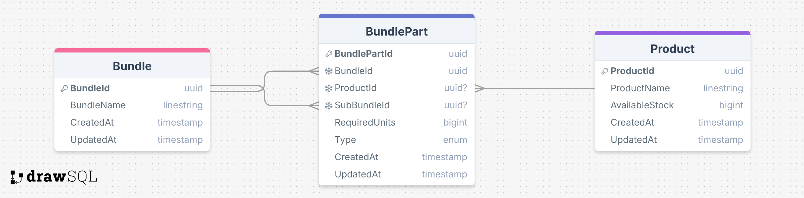

# Qoblex Technical Test

## Problem Breakdown

- A bundle is constructed from one or many products.
- A product might also be a bundle of other products.
- The product quantity to construct a bundle is noted.
- We have a stock count for each spare part.

## Solution Steps

### Approach

- Our algorithm should traverse the bundle tree structure to calculate the maximum complete Bundles that we can build based on the available stock for each Product part (node).

- It should handle Recursive structure in case of the bundle contains another bundle.

=> So : We need to traverse the tree of bundle and its products and go into the deepest level of each product until attending the leaf product before moving to the next product (this allow to handle the nodes that are bundles too).

- The maximum number of constructed bundles is depending directly on the available stock and required quantity of the sub-products.
Means :
  - The availability of required quantity in stock allows to construct a new bundle.

  - Once one of the products is not available we can't construct another more bundle.

### Algorithm

- The suitable algorithm that fit our problem is Depth-First Search (DFS) : in term of simplicity and performance, it allows to traverse the tree nodes deeply (until leaf node) before passing to another node, so we can handle nested structures (bundles that contains other bundles). Besides, before calculating the max possible built bunsles, we insure that all subproducts are available.

- The key logic is :
  - To iterate through the bundle products (by traversing the tree from top to bottom).

  - For each product, We calculate how many times it can be used in construction (available stock/required quantity).

  - Finally, a BUNDLE can only be built as long as all required PRODUCTS are available => the limitation is related to the least available product => the min calculated value.

### Technology

- Prerequisites
  - install .net 8 (executable)
  - dotnet tool install --global dotnet-ef

- Project Init process

```bash
    dotnet new console -n BundleTree
    cd BundleTree
```

Then install necessary dependencies

```bash
    dotnet add package Microsoft.EntityFrameworkCore //Add Entity Framework Core
    dotnet add package Microsoft.EntityFrameworkCore.Sqlite //SQLite provider for database
    dotnet add package Microsoft.EntityFrameworkCore.Tools //to manage migrations
```

### Folder Structure

- **/BundleTree**: Contains the main codebase of the console application.
  - **/Data**: Contains database context.
  - **/Enums**: Contains enumeration definitions used across the project.
  - **/Migrations**: Contains Entity Framework migration files.
  - **/Models**: Contains the data models used in the application.
  - **/Services**: Contains business logic and service classes.

- **.gitignore**: Specifies files and directories to be ignored by Git.

- **README.md**: This file, which provides an overview and setup instructions for the project.

- **BundleTree.sln**: The solution file for the project.

- **Program.cs**: Contains the Main method that starts the execution

### Run the project solution

First build the project to confirm no issues

```bash
    dotnet build
```

Then Run the following commands to generate migrations based on changes on our Models, then update the database schema by applying the migration

```bash
    dotnet ef migrations add Initial_Create
    dotnet ef database update
```

Run the project solution with followig command, it will generate a text file (output.txt) that highlight the results

```bash
    dotnet run > output.txt 2>&1
```

## Database Diagram


